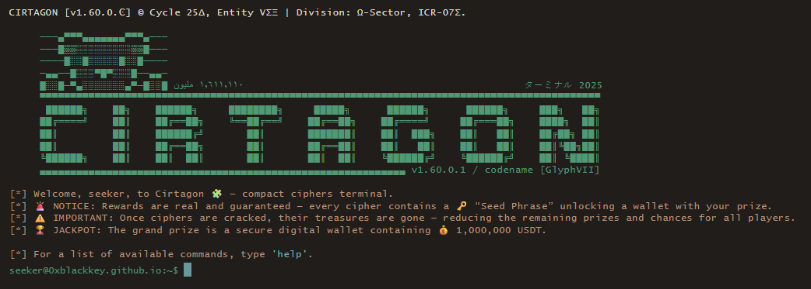

# 🎮 Cirtagon

> **A path to real riches, led by riddles — see if you’re truly on the path… or just lost in a beautiful maze.**

**Cirtagon** is a minimalist puzzle game where logic meets mystery. Players must unlock a sequence of seven arcane seals. Each seal hides a unique riddle — and a reward. The deeper you go, the greater the prize.

No sign-ups. No tracking. No tricks. Just riddles and crypto — for those clever (and stubborn) enough to win.

> ⚠️ **Note**: Some parts of this project — including UI text and structural code — were generated or refined using AI tools to accelerate development.
> However, **all core puzzles, encryption mechanisms, were handcrafted manually** to ensure fairness, originality, and integrity.

---

## 🧠 Game Overview

Cirtagon offers a layered riddle-solving journey, where:

- 🧩 **Puzzles start simple** and grow more complex — logic, pattern, obsession required.
- 🗝️ **Each seal unlocks a reward**, starting at `10 USDT`, then `100`, then `1000`...
- 🪙 **The final treasure?** A **1,000,000 USDT encrypted wallet** awaits the one who solves them all.
- 🧭 **Each challenge is crafted to be fair** but unforgiving — only full decryption grants access.

> This is not just a game — it's a test of mind and persistence.  
> Can you decode your way to fortune?

> 🚫 **Important Disclaimer**: We do **not** operate any official social media accounts or communication channels aside from the **email address provided within the game interface**.
> Any account claiming to represent *Cirtagon* outside of that is **not affiliated with us** — we bear **no responsibility** for impersonations or third-party claims.

---

## 🖼️ Preview

---

## 🔐 How It Works

- No logins. No emails. No wallets needed to play.
- You solve a cipher. It reveals a **seed phrase** — the recovery key to a wallet preloaded with USDT.
- Once solved, **you own the wallet**. Change the recovery phrase and move the funds as you wish.
- All logic runs locally in your browser. Source code is public. There’s nothing hidden.

> The rewards are real. The challenge is real. The only lock is the cipher.

---

## 💡 Why the Gradual Rewards?

This game is **not a scam**, **not a phishing trap**, and **not an airdrop trick**.

The prize structure is **deliberately progressive**:  
- `10 USDT` proves that rewards are real.  
- `100 USDT` deepens the challenge.  
- `1000 USDT` tests serious solvers.  
- `1,000,000 USDT` — the encrypted final wallet — is for the best.

We want players to verify the integrity of the game **early**, without risk. If we ever ask you for personal data, email, wallet address, or anything beyond playing… **we're scammers. Call us out.**

This game is meant to be **a pure, open challenge for minds**, not a data harvest.

---

## 🔐 The Seals

Cirtagon consists of **seven digital seals**, each guarded by an unseen voice. Solving them demands:

- Intuition  
- Pattern recognition  
- Codebreaking  
- A stubborn spirit  
- And a touch of obsession

---

## 🔍 Hidden Truths

Each reward is more than just a prize — it's a step toward a final encrypted truth.

> Those who break the seals uncover pieces of a much larger secret.  
> **Look beyond the riddle. Think like a decoder.**  
>  
> _(Read the rules. Read between the lines.)_

---

## 📦 Technology

The game is **minimal by design** — no databases, no accounts, no backend.
And the magic lies not in code complexity, but in cleverness.

- **Frontend**: HTML / CSS / JavaScript  
- **Hosting**: GitHub Pages  
- **Logic**: Fully client-side (you can inspect the code freely)

---

## 📜 License

This project is released under the [MIT License](LICENSE).

---

## 🤝 Contributions

**Why contribute to a game with a million-usdt reward?**

Because **you** might want to:

- Design riddles without knowing their solution paths  
- Create immersive UI/UX elements  
- Improve logic or accessibility  
- Strengthen open-source puzzle culture  

> Note: Contributors do **not** get access to puzzle answers or rewards.  
> _(See in-game guidelines.)_

---

## 💰 The Treasure Awaits

Solve the first seal. Claim your first reward.  
Then follow the path — deeper, darker, richer.  

> **One mind. One path. Seven secrets... hidden in plain sight.**  
> The keys to fortune lie encrypted — only the worthy shall decode them.

---

### 🔗 Stay Updated

Track development and news right here in this repository.
